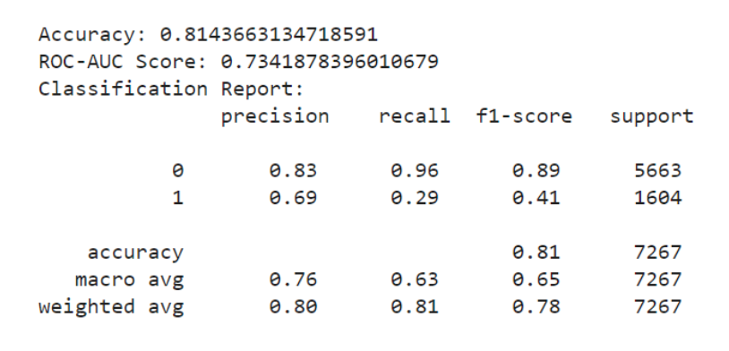
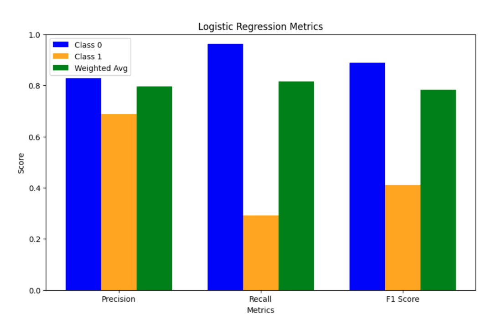
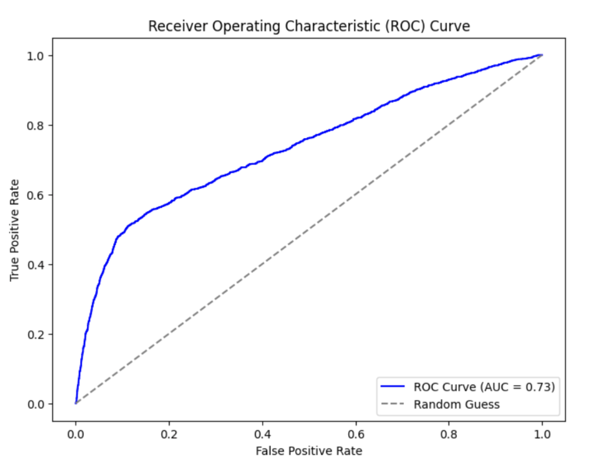

# Machine Learning Project - Credit Card Default Data

# Introduction and Background

1. Evaluation of Credit Risk - [LINK](https://cs229.stanford.edu/proj2012/SittWu-EvaluationOfCreditRisk.pdf)
2. Machine Learning for Credit Risk Prediction: A Systematic Literature Review - [LINK](https://www.mdpi.com/2306-5729/8/11/169#)
   > This review explores the use of ML in credit risk prediction, highlighting the importance of AI in processing large datasets for financial institutions. It identifies common models, metrics, and challenges like explainability and data imbalance, while offering guidance for developing credit risk management tools to minimize defaults. Key variables include demographic, operational, and payment behavior data.
3. Advancing credit risk modeling with Machine Learning: A comprehensive review of the state-of-the-art - [LINK](https://www.sciencedirect.com/science/article/pii/S0952197624012405)
   > This reviews the use of ML in consumer credit risk modeling, emphasizing its growing importance in handling large datasets and improving predictive power compared to traditional methods like Logistic Regression (LR). While ML algorithms such as Decision Trees (DT), Support Vector Machines (SVM), and Neural Networks (NN) offer potential enhancements, they face challenges in practical application. The review highlights the key steps in ML model development, from data pre-processing to parameter optimization, and stresses the need for standardized modeling procedures before deploying complex ML models commercially.

# Problem Definition
In today’s digital economy, financial institutions rely heavily on credit transaction data to evaluate creditworthiness. However, many credit scoring models primarily focus on historical credit data, which can overlook valuable insights from transaction behavior that indicate changes in an individual's financial risk.

The core problem is creditworthiness prediction: Accurately assessing an individual's credit risk is essential for lenders to make informed decisions about loans and interest rates. Current models often miss important patterns in transaction behavior that could provide a clearer picture of creditworthiness. Our model will aim to accurately predict if an individual will default on loans or not.

# Dataset
Link: https://archive.ics.uci.edu/dataset/350/default+of+credit+card+clients

Description: The Default of Credit Card Clients UCI Dataset contains data on credit card holders in Taiwan and aims to predict whether a client will default on their payment. It includes 30,000 observations and 24 features such as demographics (age, education, marital status, gender), credit card usage (bill statements, payment history), and default payment status (whether the client defaulted the next month).

# Methods
In preparation for our implementation of a logistic regression model, we preprocessed our data set with a few different methods. We addressed missing values by filling categorical columns with their most frequent value and numerical columns with the median to reduce outlier influence. We removed duplicate rows to steer away from potential model bias and removed any rows where all bill and payment amounts were zero. Outliers in key financial columns, including LIMIT_BAL (credit limit), BILL_AMT* (bill amounts over six months), and PAY_AMT* (payment amounts over six months), were handled by excluding values below the 1st percentile and above the 99th percentile. We also scaled the data to ensure that our numerical columns would have a similar scale.

As for the model, we chose to implement logistic regression because it is a supervised learning algorithm that is particularly effective with binary classification tasks. We trained the model with a 70-30 train-test split to fully determine its predictive abilities. This model turned out to be simplistic but fairly effective in classifying the data as default and non-default.

# Results and Discussion
Metrics and Analysis: Our logistic regression model was found to perform relatively well, but there is still room for improvement. For example, our overall accuracy was 81.4%, which is a significant improvement from random guessing. Additionally, our ROC-AUC score was 0.73, which is not poor considering the possible range of values between 0.5 and 1.0. The graph of the ROC curve allows us to see the relationship between our model predicting true positives and false positives. We see that our ability to correctly predict true positives while keeping the number of false positives low increases sharply until about 0.5 true positives, and then increases more slowly. This curve allows us to see this trade-off and make decisions based on our model motivation. In the context of approving loans, we want to protect banks by not approving loans for possible defaulters, but we also want to protect the customer by not denying loans for reliable candidates. The ROC curve allows us to see the interaction of these two goals.

However, the visualization of our classification report shows that our model consistently performed better when classifying “0” instances, or instances when a customer did not default. The most striking example of this is in our Recall score, which measures the false negatives. Here, 0 instances had a recall of 96%, while 1 instances only scored 29%. These discrepancies are likely due to an imbalanced dataset. Notably, our dataset contains 30,000 entries, but only 6,636 of those are labeled as “1.” 

Next Steps:

To improve our overall accuracy and reduce the differences in accuracy between 0 and 1 instances, we will use a variety of techniques. First, we will use data augmentation to create new instances of default payment examples (1 instances) so our model is able to better predict those cases. Additionally, the other models we develop will allow us to improve upon these results. Random forest and gradient boosting will allow us to improve our accuracy, F1-score, and ROC-AUC value in further iterations of our project.

Quantitative Metrics:

Visualizations:

# References
A. Montevechi, R. Miranda, A. Medeiros, and J. Montevechi, Eds., “Advancing credit risk modelling with Machine Learning: A comprehensive review of the state-of-the-art,” Aug. 2024.

Jomark Pablo Noriega, Luis Antonio Rivera, and Jose Alfredo Herrera, “Machine Learning for Credit Risk Prediction: A Systematic Literature Review,” Aug. 2023, doi: https://doi.org/10.20944/preprints202308.0947.v1.

‌M. Sitt and T. Wu, “Evaluation of Credit Risk.” Accessed: Oct. 04, 2024. [Online]. Available: https://cs229.stanford.edu/proj2012/SittWu-EvaluationOfCreditRisk.pdf

# Tables
Gantt Chart: [LINK](https://docs.google.com/spreadsheets/d/1_VUAMo002Tv-8mLRiyFK3bGIlX5s4-en/edit?usp=sharing&ouid=112209367681545806735&rtpof=true&sd=true)

Contribution Table

|Name|Contributions|
|---|---|
|Sive|Visualizations, Results and Discussion, Gantt Chart|
|Maha|Data Cleaning and logistic regression, Results, Visualizations, Discussion|
|Esther|Results, Visualizations, Discussion|
|Avalyn|Data Cleaning and logistic regression, Methods|
|Mahibah|Data Cleaning and logistic regression, Github pages|

