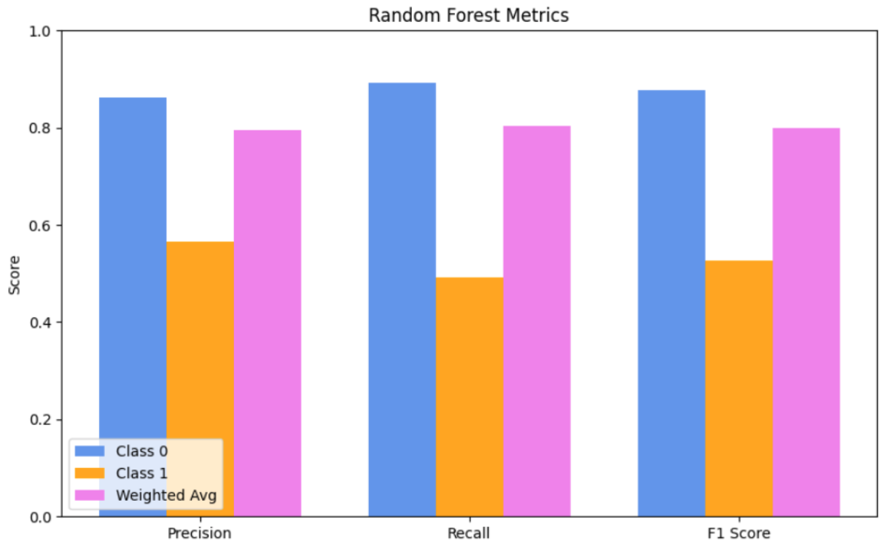

# Machine Learning Project - Credit Card Default Data

# Project Video
The video for this project is available at [https://youtu.be/T9iZuKjVL4o](https://youtu.be/T9iZuKjVL4o)

# Introduction and Background

1. Evaluation of Credit Risk - [LINK](https://cs229.stanford.edu/proj2012/SittWu-EvaluationOfCreditRisk.pdf)
2. Machine Learning for Credit Risk Prediction: A Systematic Literature Review - [LINK](https://www.mdpi.com/2306-5729/8/11/169#)
   > This review explores the use of ML in credit risk prediction, highlighting the importance of AI in processing large datasets for financial institutions. It identifies common models, metrics, and challenges like explainability and data imbalance, while offering guidance for developing credit risk management tools to minimize defaults. Key variables include demographic, operational, and payment behavior data.
3. Advancing credit risk modeling with Machine Learning: A comprehensive review of the state-of-the-art - [LINK](https://www.sciencedirect.com/science/article/pii/S0952197624012405)
   > This reviews the use of ML in consumer credit risk modeling, emphasizing its growing importance in handling large datasets and improving predictive power compared to traditional methods like Logistic Regression (LR). While ML algorithms such as Decision Trees (DT), Support Vector Machines (SVM), and Neural Networks (NN) offer potential enhancements, they face challenges in practical application. The review highlights the key steps in ML model development, from data pre-processing to parameter optimization, and stresses the need for standardized modeling procedures before deploying complex ML models commercially.

# Problem Definition
In today’s digital economy, financial institutions rely heavily on credit transaction data to evaluate creditworthiness. However, many credit scoring models primarily focus on historical credit data, which can overlook valuable insights from transaction behavior that indicate changes in an individual's financial risk.

The core problem is creditworthiness prediction: Accurately assessing an individual's credit risk is essential for lenders to make informed decisions about loans and interest rates. Current models often miss important patterns in transaction behavior that could provide a clearer picture of creditworthiness. Our model will aim to accurately predict if an individual will default on loans or not.

# Dataset
Link: https://archive.ics.uci.edu/dataset/350/default+of+credit+card+clients

Description: The Default of Credit Card Clients UCI Dataset contains data on credit card holders in Taiwan and aims to predict whether a client will default on their payment. It includes 30,000 observations and 24 features such as demographics (age, education, marital status, gender), credit card usage (bill statements, payment history), and default payment status (whether the client defaulted the next month).

# Methods
In preparation for the implementation of our models, we preprocessed our data set with a few different methods. We addressed missing values by filling categorical columns with their most frequent value and numerical columns with the median to reduce outlier influence. We removed duplicate rows to steer away from potential model bias and removed any rows where all bill and payment amounts were zero. Outliers in key financial columns, including LIMIT_BAL (credit limit), BILL_AMT* (bill amounts over six months), and PAY_AMT* (payment amounts over six months), were handled by excluding values below the 1st percentile and above the 99th percentile. We also scaled the data to ensure that our numerical columns would have a similar scale.

After completing our midterm report, we noticed that our model was not performing well with classifying positive instances of the data because the dataset was imbalanced - notably, our dataset contained 30,000 entries, but only 6,636 of those were labeled as “1.” To remedy this, we utilized synthetic minority oversampling technique (SMOTE) to create a more balanced dataset that our models could learn from.

As for our first model, we chose to implement logistic regression because it is a supervised learning algorithm that is particularly effective with binary classification tasks. We trained the model with a 70-30 train-test split to fully determine its predictive abilities. This model turned out to be simplistic but fairly effective in classifying the data as default and non-default.

For our next model, we chose to implement gradient boosting. This algorithm utilizes an iterative approach that is suitable for capturing non-linear relationships. Also, its prediction performance with small and medium datasets is generally good. For these reasons, we thought that gradient boosting would perform well on our dataset.

Lastly, we implemented a random forest algorithm. We believed this algorithm could perform well due to its inherent capability to handle imbalanced data. It also uses feature importance to guide splits, so we believed this could be beneficial.

# Results and Discussion
Analysis of 3+ Algorithms:

Logistic Regression

Logistic Regression serves as a straightforward, interpretable model that performs reasonably well for the majority class (Class 0), as evidenced by its strong precision and recall metrics for this class. However, its metrics for Class 1, particularly recall and F1-score, are significantly lower, indicating that it struggles to correctly identify defaulters (true positives for Class 1). While the weighted averages for precision, recall, and F1-score suggest decent overall performance, these averages are skewed by the class imbalance. The AUC of 0.727 reflects its moderate ability to differentiate between defaulters and non-defaulters but highlights its limitations in modeling complex, non-linear relationships in the dataset.Logistic Regression’s simplicity ensures fast computation and ease of interpretation, making it a good baseline model for binary classification problems.

Gradient Boosting

Gradient Boosting demonstrates a significant leap in performance compared to Logistic Regression, particularly for Class 1. It achieves higher precision, recall, and F1-scores, reflecting its ability to handle data imbalance and complex patterns. The iterative nature of Gradient Boosting enables it to correct errors made in previous iterations, making it highly effective for capturing non-linear relationships in the data. 

Additionally, the ROC-AUC score for Gradient Boosting was 0.767, the highest of the three models. This supports the narrative that Gradient Boosting showcases stronger discriminatory power. This suggests that Gradient Boosting improves precision, recall, and F1-score through its iterative refinement, as well as significantly enhances the model's overall ability to differentiate between defaulters and non-defaulters as measured by the AUC.

Although Gradient Boosting’s computational cost and sensitivity to hyperparameter tuning remain challenges, its nuanced handling of minority classes typically makes it advantageous in imbalanced datasets.

Random Forest

Random Forest also outperforms Logistic Regression, with metrics that are closer to Gradient Boosting, albeit slightly lower. The model shows balanced precision, recall, and F1-score for both classes, indicating its robustness. However, the recall for Class 1 is slightly lower than Gradient Boosting, leading to a marginally reduced F1-score for defaulters.The AUC of 0.765 indicates that Random Forest has stronger discriminatory power than Logistic Regression (0.727) and slightly lower than Gradient Boosting (0.767). This suggests that Random Forest is better at distinguishing between defaulters and non-defaulters overall, despite slightly lower metrics for Class 1 compared to Gradient Boosting. This discrepancy may arise from Random Forest’s ensemble approach, which captures a wider range of patterns, even in imbalanced datasets.

Random Forest's ability to rank feature importance can provide valuable insights into the dataset, aiding in interpretability. Additionally, it reduces overfitting by averaging predictions from multiple trees. While it lacks the iterative refinements of Gradient Boosting that specifically target errors in the minority class, its computational efficiency and robustness make it a practical alternative, especially in scenarios with limited resources or less need for extensive hyperparameter tuning.

Comparison of 3+ Algorithms

Class 1 Performance: Gradient Boosting achieves the highest F1-score for Class 1 (0.54), followed closely by Random Forest (0.53) and Logistic Regression (0.49). This demonstrates Gradient Boosting's superior ability to capture patterns in the minority class (Class 1) compared to the other models. Notably, Logistic Regression has the highest recall for Class 1 (0.56), suggesting it identifies more true positives, but this comes at the cost of lower precision (0.43). In contrast, Gradient Boosting strikes a better balance between precision and recall for Class 1.

Overall Metrics (Weighted Average): Random Forest and Gradient Boosting both achieve the highest weighted average F1-score (0.80), with Logistic Regression slightly trailing at 0.75. However, Gradient Boosting stands out with the highest ROC-AUC score (0.7665), indicating stronger overall discriminatory power between the classes. Random Forest’s performance was comparable to Gradient Boosting in almost all metrics, with only slight differences in measurements such as recall or Precision. Logistic Regression is outperformed in all weighted average metrics, and its lower ROC-AUC score reveals limitations in distinguishing between defaulters and non-defaulters on an overall scale. However, it still remains the simplest and fastest model to implement.

Table of Quantitative Metrics:

Visualizations:

Logistic Regression:

Gradient Boosting:

Random Forest:

Combined Results:

Best Implementation

Gradient Boosting emerges as the best implementation due to its strong overall performance, achieving a weighted average F1-score of 0.80 and the highest ROC-AUC score (0.7665). Random Forest also performed well on the dataset, losing only slightly to Gradient Boosting on Class 1 performance with a lower F1-score (0.53) compared to Gradient Boosting (0.54). Gradient Boosting balances computational efficiency, interpretability through feature importance, and robust performance for both classes.

Additionally, since Gradient Boosting performs well for Class 1, it is shown to be a good choice in scenarios where minority class identification is critical. In our dataset specifically, being approved or denied for a loan based on default risk can have a large effect on customers’ or banks’ well-being, and the importance of creating accurate models cannot be overstated.

Next Steps:

Reflection upon our first few algorithms and our imbalanced data led us to implement methods like synthetic minority oversampling technique (SMOTE). This did successfully increase the recall for 1 instances in all of our models, however it did have a slight negative effect on our overall accuracy. To address this and improve overall performance, our next steps would include hyperparameter tuning and further feature engineering. This would help increase accuracy and remove less important features from our models. It would also be beneficial to look into other models to see if they could provide additional improvements.

# References
A. Montevechi, R. Miranda, A. Medeiros, and J. Montevechi, Eds., “Advancing credit risk modelling with Machine Learning: A comprehensive review of the state-of-the-art,” Aug. 2024.

Jomark Pablo Noriega, Luis Antonio Rivera, and Jose Alfredo Herrera, “Machine Learning for Credit Risk Prediction: A Systematic Literature Review,” Aug. 2023, doi: https://doi.org/10.20944/preprints202308.0947.v1.

‌M. Sitt and T. Wu, “Evaluation of Credit Risk.” Accessed: Oct. 04, 2024. [Online]. Available: https://cs229.stanford.edu/proj2012/SittWu-EvaluationOfCreditRisk.pdf

# Tables
Gantt Chart: [LINK](https://docs.google.com/spreadsheets/d/1_VUAMo002Tv-8mLRiyFK3bGIlX5s4-en/edit?usp=sharing&ouid=112209367681545806735&rtpof=true&sd=true)

Contribution Table

|Name|Contributions|
|---|---|
|Sive|Data augmentation, Visualizations, Gantt Chart|
|Maha|Video, Comparison of 3+ Algorithms / Models|
|Esther|Analysis of 3+ Algorithms / Models, Comparison of 3+ Algorithms / Models|
|Avalyn|Models, Methods, Next Steps|
|Mahibah|Models, GitHub Page|

